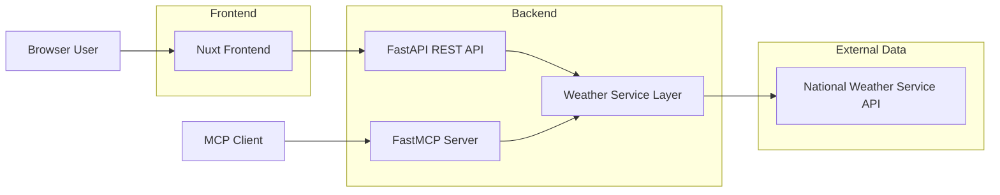
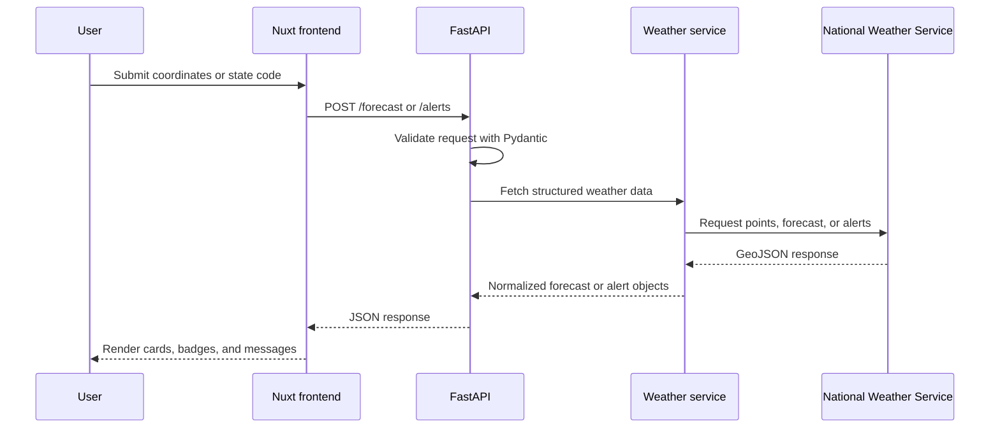
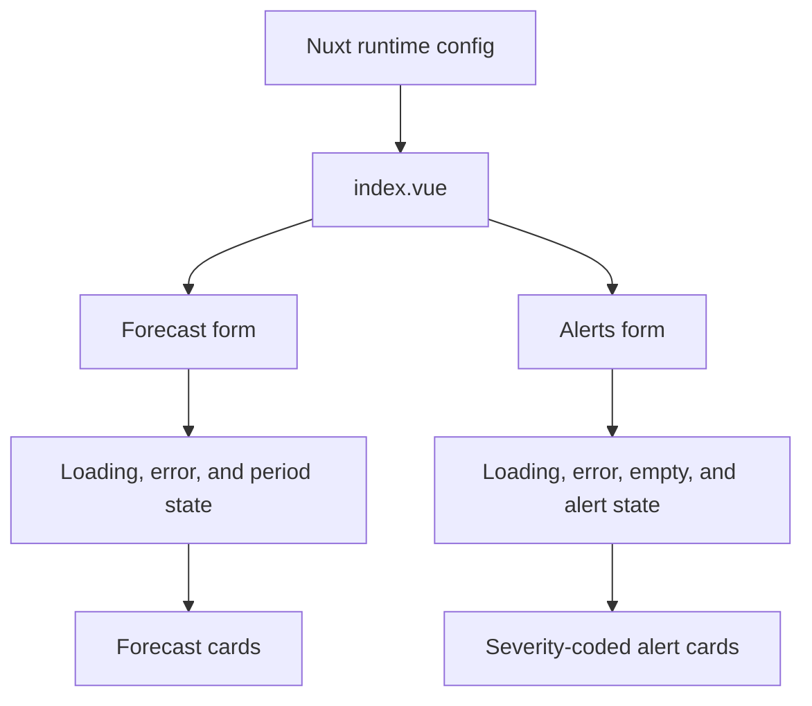

# Weather MCP

A small full-stack weather application that exposes National Weather Service data through an MCP server, a FastAPI bridge, and a Nuxt frontend.

## Features

- MCP tools for active alerts and short-range forecasts
- FastAPI endpoints for browser and frontend clients
- Structured JSON responses for forecasts and alerts
- Nuxt UI with forecast cards, alert severity styling, loading states, and validation
- Backend tests that mock upstream weather calls

## Architecture



The app has two entry points over one shared weather service layer. Browser users call the FastAPI bridge through the Nuxt dashboard, while MCP clients call the FastMCP tools directly. Both paths reuse the same National Weather Service integration.

## Request Flow



## Backend Design

```mermaid
classDiagram
    class api_py {
        FastAPI app
        POST /forecast
        POST /alerts
        Pydantic validation
        HTTP error mapping
    }

    class weather_py {
        fetch_forecast()
        fetch_alerts()
        get_forecast()
        get_alerts()
        create_mcp_server()
    }

    class NationalWeatherService {
        /points/{lat},{lon}
        /gridpoints/.../forecast
        /alerts/active/area/{state}
    }

    api_py --> weather_py : imports service functions
    weather_py --> NationalWeatherService : httpx requests
```

`weather.py` keeps MCP registration lazy so importing the service from FastAPI does not start MCP machinery. REST endpoints return structured JSON, while MCP tools format the same data as readable text.

## Frontend Design



The Nuxt page consumes API objects directly instead of parsing display text. Runtime config controls the backend URL through `NUXT_PUBLIC_API_BASE`, which keeps local development and deployment settings separate from the component code.

## Requirements

- Python 3.13+
- uv
- Node.js 20+
- npm

## Backend

Install Python dependencies:

```bash
uv sync
```

Run the FastAPI server:

```bash
uv run uvicorn api:app --host 127.0.0.1 --port 8001
```

Run the MCP server over stdio:

```bash
uv run python weather.py
```

Run tests:

```bash
uv run python -m unittest
```

## Frontend

Install frontend dependencies:

```bash
cd frontend
npm install
```

Run the Nuxt dev server:

```bash
npm run dev -- --host 127.0.0.1 --port 3003
```

By default, the frontend calls `http://localhost:8001`. Override it with:

```bash
NUXT_PUBLIC_API_BASE=http://localhost:8001 npm run dev
```

## API

### `POST /forecast`

```json
{
  "latitude": 37.7749,
  "longitude": -122.4194
}
```

### `POST /alerts`

```json
{
  "state": "CA"
}
```

## Notes

The National Weather Service API primarily supports United States locations. Non-US coordinates may return a not-found response.
