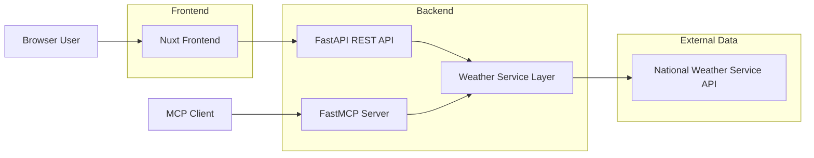
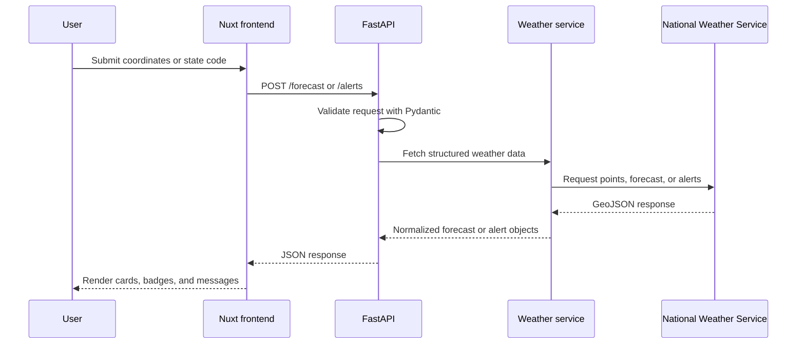
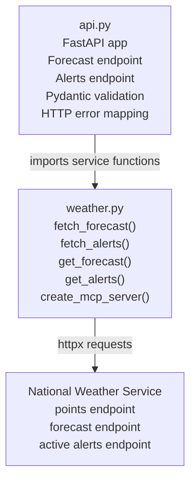
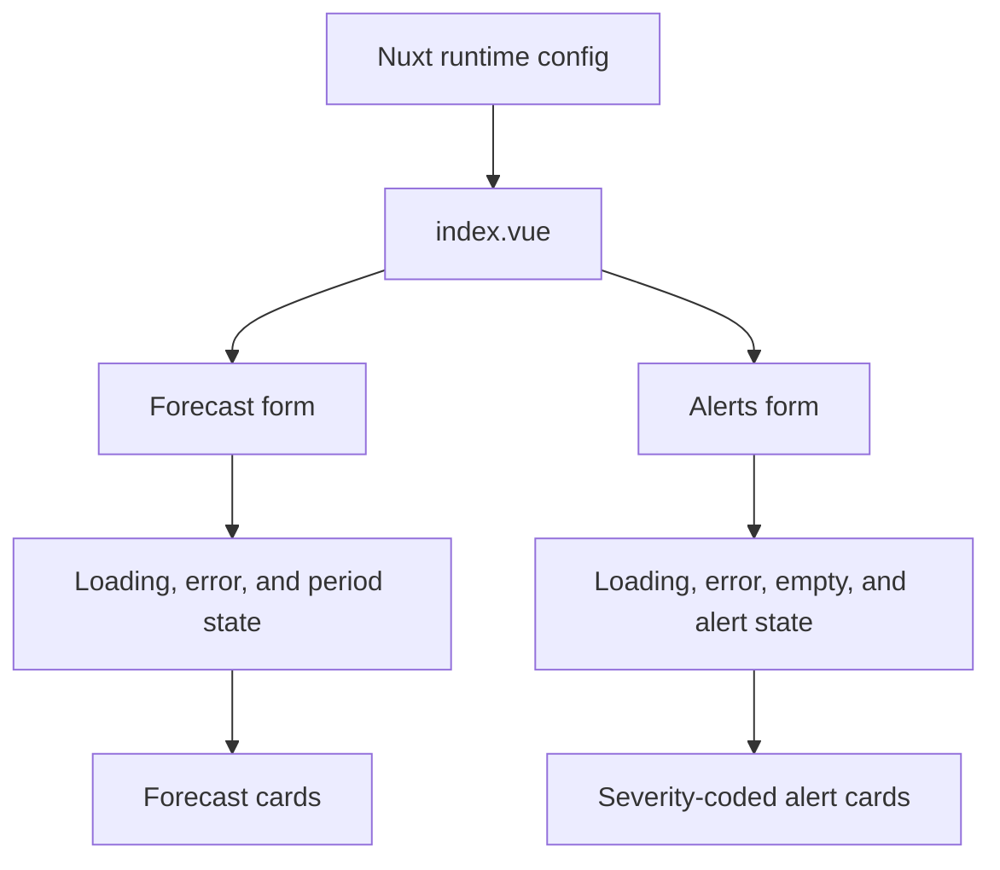

# Weather MCP

[](https://github.com/iamMashel/weather_mcp/actions/workflows/ci.yml)


An MCP-powered full-stack weather application that exposes National Weather Service data through an MCP server, a FastAPI bridge, and a Nuxt dashboard.

## Why It Matters

Weather MCP demonstrates a clean pattern for building AI-tooling projects that are also useful as normal web apps. The core weather service is shared by both the MCP tools and the REST API, so the system avoids duplicate business logic while supporting agent clients and browser users.

## Features

- MCP tools for active alerts and short-range forecasts
- FastAPI endpoints for browser and frontend clients
- Structured JSON responses for forecasts and alerts
- Nuxt UI with forecast cards, alert severity styling, loading states, and validation
- Backend tests that mock upstream weather calls

## Tech Stack

| Layer | Tools |
| --- | --- |
| MCP server | FastMCP, Python |
| API | FastAPI, Pydantic, httpx |
| Frontend | Nuxt 4, Vue 3 |
| Package management | uv, npm |
| Quality | unittest, GitHub Actions |

## Architecture



The app has two entry points over one shared weather service layer. Browser users call the FastAPI bridge through the Nuxt dashboard, while MCP clients call the FastMCP tools directly. Both paths reuse the same National Weather Service integration.

## Request Flow



## Backend Design



`weather.py` keeps MCP registration lazy so importing the service from FastAPI does not start MCP machinery. REST endpoints return structured JSON, while MCP tools format the same data as readable text.

## Frontend Design



The Nuxt page consumes API objects directly instead of parsing display text. Runtime config controls the backend URL through `NUXT_PUBLIC_API_BASE`, which keeps local development and deployment settings separate from the component code.

## Requirements

- Python 3.13+
- uv
- Node.js 20+
- npm

## Quickstart

Run the backend:

```bash
uv sync
uv run uvicorn api:app --host 127.0.0.1 --port 8001
```

Run the frontend:

```bash
cd frontend
npm install
npm run dev -- --host 127.0.0.1 --port 3003
```

Open `http://127.0.0.1:3003`.

## Backend

Install Python dependencies:

```bash
uv sync
```

Run the FastAPI server:

```bash
uv run uvicorn api:app --host 127.0.0.1 --port 8001
```

Run the MCP server over stdio:

```bash
uv run python weather.py
```

Run tests:

```bash
uv run python -m unittest discover -s tests -v
```

## Frontend

Install frontend dependencies:

```bash
cd frontend
npm install
```

Run the Nuxt dev server:

```bash
npm run dev -- --host 127.0.0.1 --port 3003
```

By default, the frontend calls `http://localhost:8001`. Override it with:

```bash
NUXT_PUBLIC_API_BASE=http://localhost:8001 npm run dev
```

## API

### `POST /forecast`

```json
{
  "latitude": 37.7749,
  "longitude": -122.4194
}
```

Example response:

```json
{
  "data": [
    {
      "name": "Tonight",
      "temperature": 56,
      "temperatureUnit": "F",
      "windSpeed": "8 mph",
      "windDirection": "W",
      "shortForecast": "Mostly Clear",
      "detailedForecast": "Mostly clear, with a low around 56.",
      "icon": "https://api.weather.gov/icons/land/night/skc",
      "isDaytime": false
    }
  ]
}
```

### `POST /alerts`

```json
{
  "state": "CA"
}
```

## Quality Checks

```bash
uv run python -m unittest discover -s tests -v
cd frontend && npm run build
```

## Roadmap

- City search with geocoding
- Hourly forecast endpoint
- Temperature and wind charts
- Alert map with affected zones
- Response caching for NWS calls
- Deployment guide for a public demo

## Contributing

Contributions are welcome. Please open an issue first for larger changes so the design can stay focused.

## Notes

The National Weather Service API primarily supports United States locations. Non-US coordinates may return a not-found response.
